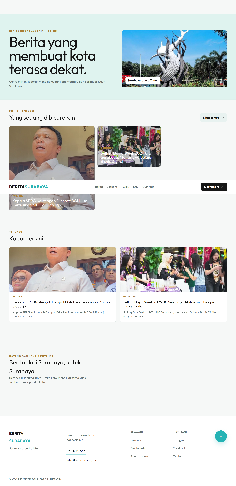

# BeritaSurabaya



Portal berita lokal Surabaya dengan tampilan editorial untuk pembaca dan dashboard redaksi untuk mengelola berita serta kategori.

## Deskripsi Project

BeritaSurabaya adalah aplikasi full-stack dalam satu repository yang terdiri dari:

- `backend/`: REST API Express dengan raw SQL `mysql2/promise`, autentikasi JWT, bcrypt, upload thumbnail, dan MySQL.
- `frontend/`: Nuxt 4 + TypeScript + Pinia + Axios + Tailwind/Icon untuk halaman publik dan dashboard admin.
- `schema.sql`: database, relasi, index, dan seed data kategori serta berita.

Fitur utama:

- Homepage dengan hero Surabaya, pilihan redaksi, berita terbaru, dan peta lokasi.
- Berita berdasarkan kategori: Ekonomi, Politik, Seni, dan Olahraga.
- Pencarian berita dengan live search dan pagination.
- Detail berita dengan increment views.
- Login admin dengan JWT.
- CRUD berita dengan status `draft` atau `published`.
- Upload thumbnail dan preview gambar saat membuat atau mengedit berita.
- CRUD kategori.

## Struktur Repository

```text
.
├── backend/
├── frontend/
├── preview.png
├── schema.sql
├── README.md
└── .gitignore
```

## Prasyarat

- Bun versi terbaru
- Laragon atau MySQL aktif
- Database MySQL `portal_berita`

Konfigurasi default Laragon:

```env
DB_HOST=127.0.0.1
DB_USER=root
DB_PASS=
DB_NAME=portal_berita
```

## Tahapan Instalasi

### 1. Clone repository

```bash
git clone https://github.com/USERNAME/NAMA-REPOSITORY.git
cd NAMA-REPOSITORY
```

### 2. Siapkan database

Import `schema.sql` melalui HeidiSQL, phpMyAdmin, atau MySQL CLI:

```bash
mysql -u root portal_berita < schema.sql
```

Jika database belum dibuat:

```bash
mysql -u root < schema.sql
```

### 3. Install backend

```bash
cd backend
bun install
cp .env.example .env
```

Pada Windows PowerShell, gunakan perintah berikut jika `cp` tidak tersedia:

```powershell
Copy-Item .env.example .env
```

Pastikan `backend/.env` berisi password kosong untuk Laragon:

```env
DB_HOST=127.0.0.1
DB_USER=root
DB_PASS=
DB_NAME=portal_berita
JWT_SECRET=portal-berita-local-secret
PORT=3000
```

### 4. Install frontend

```bash
cd ../frontend
bun install
```

Frontend menggunakan konfigurasi berikut pada `frontend/.env`:

```env
NUXT_PUBLIC_API_BASE=http://localhost:3000/api
NUXT_PUBLIC_UPLOADS_BASE=http://localhost:3000
```

## Tahapan Menjalankan

Jalankan backend terlebih dahulu:

```bash
cd backend
bun run seed:admin
bun run dev
```

Backend tersedia di:

```text
http://localhost:3000
```

Buka terminal baru, lalu jalankan frontend:

```bash
cd frontend
bun run dev
```

Frontend tersedia di:

```text
http://localhost:3001
```

Health check API:

```text
http://localhost:3000/api/health
```

## Login Admin

```text
Email    : admin@portalberita.test
Password : admin123
```

## API Utama

| Method | Endpoint | Keterangan |
| --- | --- | --- |
| `GET` | `/api/health` | Cek API |
| `POST` | `/api/auth/login` | Login admin |
| `GET` | `/api/auth/me` | Data admin aktif |
| `GET` | `/api/berita` | List berita, search, filter, pagination |
| `GET` | `/api/berita/:slug` | Detail berita dan increment views |
| `GET` | `/api/berita/id/:id` | Detail berita admin termasuk draft |
| `POST` | `/api/berita` | Tambah berita, protected, multipart |
| `PUT` | `/api/berita/:id` | Edit berita, protected, multipart |
| `DELETE` | `/api/berita/:id` | Hapus berita, protected |
| `GET` | `/api/kategori` | List kategori |
| `POST/PUT/DELETE` | `/api/kategori` | CRUD kategori, protected |

## Membuat Repository GitHub Public

1. Buat satu repository baru di GitHub.
2. Pilih visibility **Public**.
3. Jangan membuat repository terpisah untuk `backend` dan `frontend`.
4. Jalankan perintah berikut dari root project:

```bash
git init
git add .
git commit -m "feat: build BeritaSurabaya portal"
git branch -M main
git remote add origin https://github.com/USERNAME/NAMA-REPOSITORY.git
git push -u origin main
```

Pastikan file `.env` tidak ikut ter-push. Yang boleh masuk repository hanya `.env.example`.
